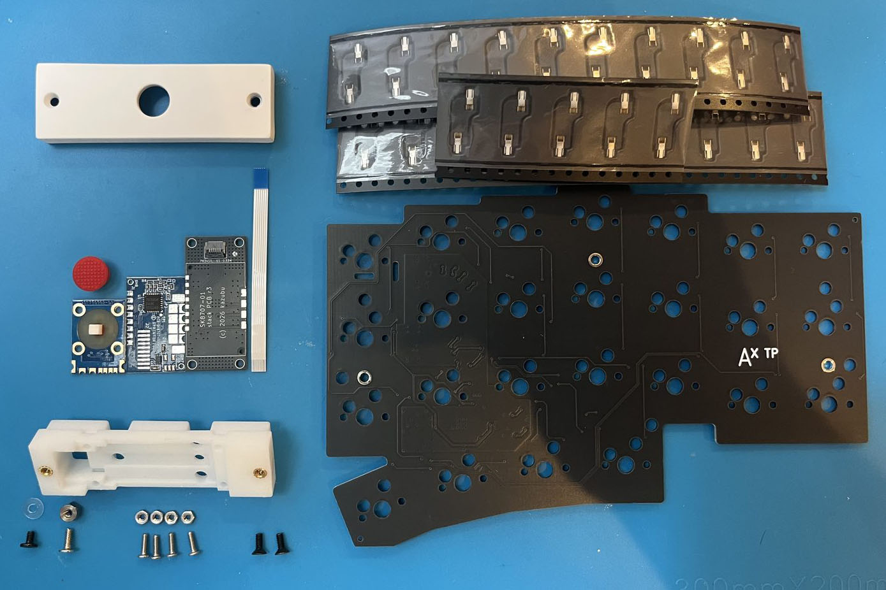

# Parts & Tools

Check that you have every part before starting the build.

## Stock Altair-X parts

See the [official Altair-X build guide](https://ai03.com/info/build-guides/altair/).

## Mod-specific parts

{ loading=lazy }

| Part | Qty | Notes |
| --- | --- | --- |
| Right-half PCB | 1 | With the TrackPoint connector |
| MX hot-swap socket | 22 | |
| Sprintek SK8707-01-004 pointing stick module | 1 | |
| Mount PCB | 1 | r3 |
| Stick cap | 1 | |
| FPC cable | 1 | 6P x 0.5mm, 50mm, reversed contacts |
| TrackPoint mounting part | 1 | |
| TrackPoint module cover | 1 | |
| M2 x 5mm low-profile screw | 1 | PCB to mounting part |
| M2 x 3mm low-profile screw | 1 | PCB to mounting part |
| M2 plastic washer | 2 | PCB to mounting part |
| M2 x 3mm hex standoff | 1 | PCB to mounting part |
| M1.6 x 5mm low-profile screw | 4 | Mount PCB |
| M1.6 nut | 4 | Mount PCB |
| M2 flat-head screw (hex) | 2 | Cover |

!!! tip "About the SK8707 part number"

    This mod is built and tested with the **SK8707-01-004**. Other SK8707 suffixes differ in stick height, supply voltage and board size. The mount PCB is designed around the SK8707-01-004 footprint, so other suffixes cannot be used.

## Required tools

- [ ] Soldering iron and solder
- [ ] Solder wick / desoldering pump
- [ ] Flux
- [ ] Tweezers
- [ ] Phillips screwdrivers (+2.5, +3.0)
- [ ] Hex drivers (H1.5, H2.0)
- [ ] Multimeter (continuity testing)

---

Once you have everything, continue to [PCB Assembly](02-pcb.md).
