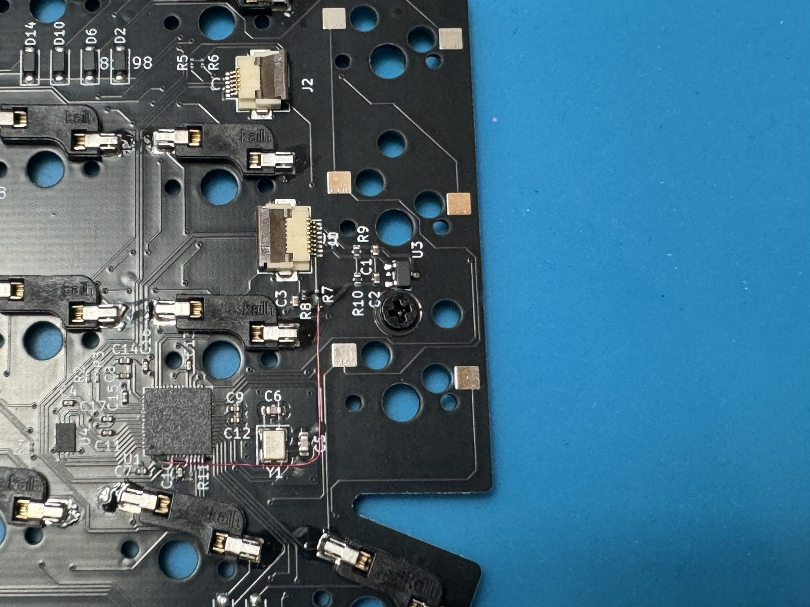
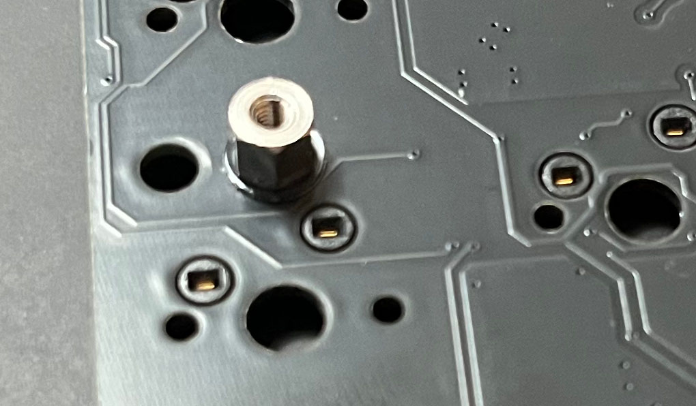
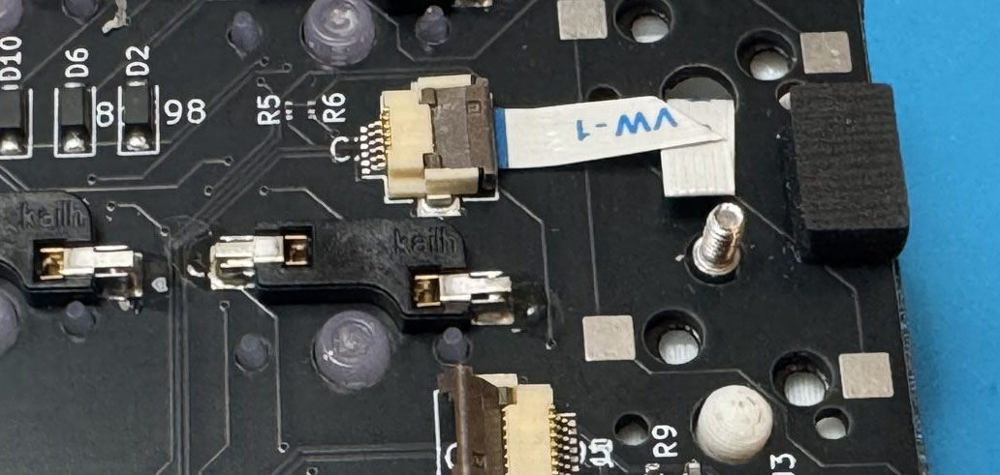

# 基板の実装

Altair-X の基板側の作業です。トラックポイントの組み込み前に、キーボード単体として動く状態を作ります。

## 1. 基板の目視確認

- [ ] 基板の反り・傷・ランドの欠けがないか確認
- [ ] シルクの向き（表裏）を確認

## 2. スイッチソケットの実装

ホットスワップソケットを基板にはんだ付けします。最内列の 3 キーについては、パッドは実装されていますが、ソケットを取り付ける必要はありません。

{ loading=lazy }

## 3. トラックポイント固定用スペーサーの取り付け

M2 x 3mm のネジとワッシャー x2 を使って、M2 x 3mm の六角スペーサーを基板上に取り付けます。

ネジ｜ワッシャー｜基板｜ワッシャー｜六角スペーサー の順で挟んでネジ止めしてください。

{ loading=lazy }

## 4. トラックポイント接続用 FPC ケーブル

FPC ケーブルを基板裏面の J2 コネクタに挿入し、次の順に折ってから基板表側に出しておきます。

1. J2 から右向きに出たケーブルを **45° の斜め折り**で下向きにする
2. **180° 折り返して**上向きにする
3. J2 の右上にある **最上段スイッチのセンターポール穴**を通して基板表側へ出す

折り返しが必要なのは、リバース配線の FPC ケーブルの端子面を正しい側に向けるためです。45° の斜め折りだけでは向きは 90° 変わるものの表裏が入れ替わってしまうため、180° の折り返しでもう一度戻します。

--8<-- "snippets/fpc-fold.ja.svg"

{ loading=lazy }

!!! warning "折り目は一度で決める"

    同じ位置で折り曲げ直したり、爪などで鋭く折り込んだりすると導体が断線します。折り目は指の腹で軽く押さえる程度にとどめてください。

## 5. 動作確認（トラックポイント組み込み前）

この時点で一度ファームウェアを書き込み、全キーが反応するか確認します。

1. USB で PC に接続する
2. [ファームウェアの書き込み](05-firmware.md) の手順でフラッシュする
3. [キー入力テストサイト](https://config.qmk.fm/#/test) などで全キーを確認する

- [ ] 全キーが反応する
- [ ] チャタリングや同時入力がない

なお、トラックポイントモジュールを接続していない場合、入力に遅延が発生することがあります。最終組み立ての前に再度、トラックポイントモジュールを接続して動作確認することをおすすめします。

!!! success "ここまで問題なければ"

    [トラックポイントの組み込み](03-trackpoint.md) に進みます。反応しないキーがある場合は先に [トラブルシュート](../troubleshooting.md) を確認してください。
