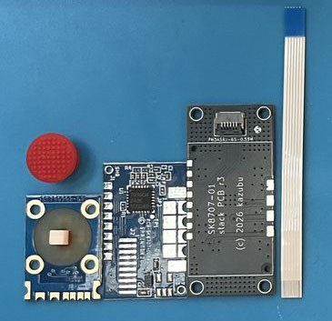
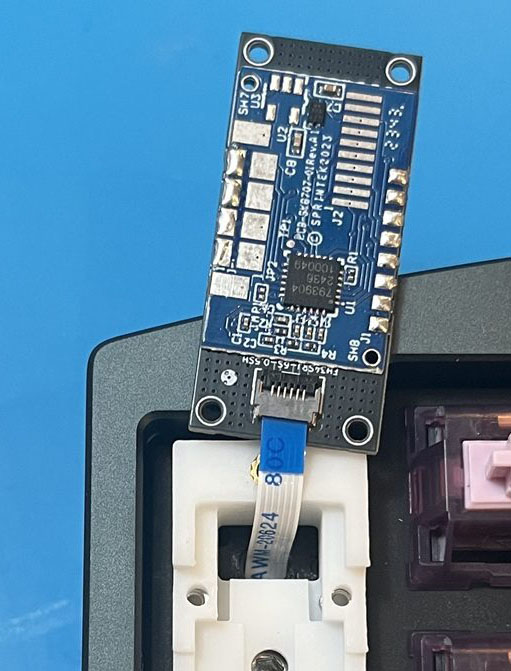

# TrackPoint Integration

The core of this mod: soldering the **Sprintek SK8707-01-004** pointing stick module to the dedicated mount PCB and installing it in the innermost column of the right half of the Altair-X.

!!! info "The module"

    - Module: Sprintek **SK8707-01-004**
    - Interface: internal PS/2 (CLK / DATA / RST)
    - Operating voltage: 3.3V
    - Mount PCB: dedicated board for this mod (r3)

## 1. Check the parts

{ loading=lazy }

- [ ] SK8707-01-004 module
- [ ] Mount PCB
- [ ] Stick cap
- [ ] FPC cable

## 2. Soldering to the mount PCB

Solder the SK8707-01-004 to the mount PCB.

The SK8707-01-004 comes as a separate stick board and controller board; soldering the controller board first is recommended.

{ loading=lazy }

- [ ] Check the orientation (front / back) of the mount PCB against the silkscreen
- [ ] Place the controller board on the mount PCB, align it, and tack two diagonal pins
- [ ] Solder the remaining pins
- [ ] Place the stick board on the mount PCB, align it, and tack one or two points
- [ ] Check that the stick stands perpendicular to the board
- [ ] Solder the remaining pads
- [ ] Heat the mount PCB pad through the mounting hole in the stick board and fix the stick board with solder
- [ ] Inspect for bridges and unsoldered joints with a loupe
- [ ] Check with a multimeter that VCC and GND are not shorted

!!! tip "Get the alignment right while tacked"

    Correcting the tilt of the stick while only a couple of joints are tacked saves trouble during the clearance check later. It is very hard to fix once every pad is soldered.

## 3. Test

Connect the FPC cable prepared in [PCB Assembly](02-pcb.md) ("FPC cable for the TrackPoint") to the mount PCB and test it. Both ends of the FPC cable must have their contacts facing the board.

1. Flash TrackPoint-enabled firmware ([Flashing Firmware](05-firmware.md))
2. Connect over USB and move the stick to check that the cursor moves

!!! warning "Do not touch the stick at power-on"

    The module calibrates itself when powered up; touching it during boot causes drift.

- [ ] The cursor moves in every direction
- [ ] Cursor direction matches the direction you push the stick
- [ ] The cursor stops when you let go (no drift)

!!! failure "No movement, or movement on its own"

    See the TrackPoint section of [Troubleshooting](../troubleshooting.md).

---

Once it works, continue to [Case Assembly](04-assembly.md).
