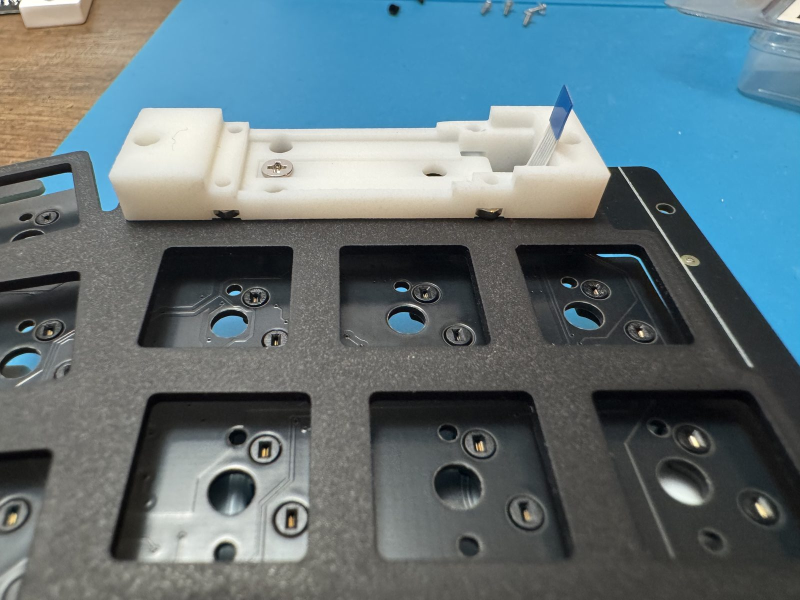
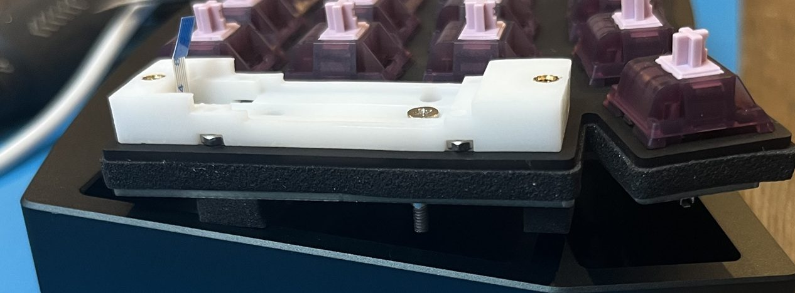
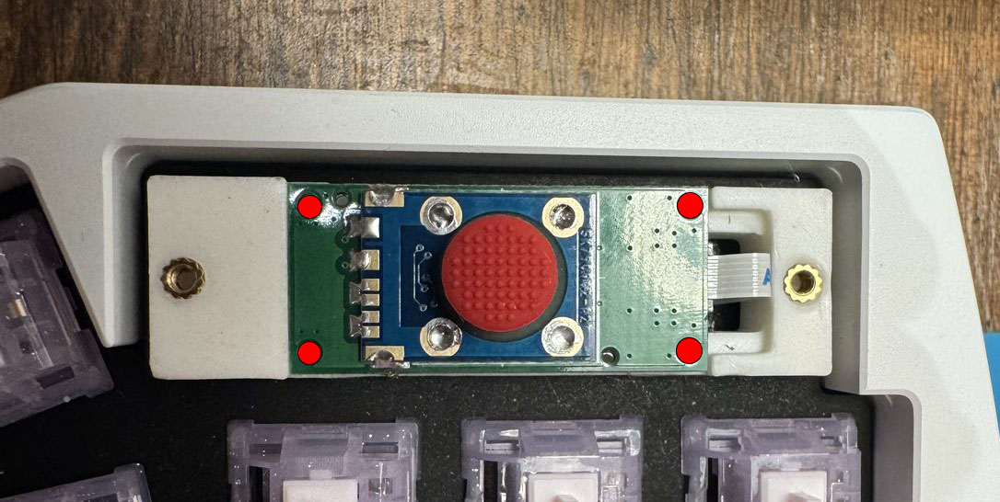

# ケースの組み立て

左手側については [Altair-X 公式ビルドガイド](https://ai03.com/info/build-guides/altair/) の通りに組み立ててください。

右手側については、公式ビルドガイドの [Assembling the internals](https://ai03.com/info/build-guides/altair/4/) までを実施後、以下の手順に従ってください。
なお、トラックポイントモジュールを配置する最内列のキーについては実装しないでください。

## 1. トラックポイントモジュールの取り付け

- [ ] プレートの上からトラックポイント固定用パーツを差し込み、M2 x 5mm のネジで固定する
- [ ] FPC ケーブルを基板の裏から穴を通して、固定用パーツから飛び出るようにする

    { loading=lazy }

- [ ] M1.6 ナットを固定用パーツの左右（特に左）の穴から挿入しておく（あとの工程で落とさないように注意）

    { loading=lazy }

- [ ] [Putting it all together](https://ai03.com/info/build-guides/altair/5/) の通りに組み立てを続行し、基板をケースに固定する
- [ ] FPC ケーブルをマウント基板に接続する

    { loading=lazy }

- [ ] マウント基板を固定用パーツに差し込み、M1.6 x 5mm のネジで固定する（強く締め付けすぎないように注意）

    { loading=lazy }

## 2. カバーとキーキャップの取り付け

- [ ] トラックポイントモジュールカバーを M2 皿ネジ 2 本で固定する
- [ ] スティックキャップを取り付ける

公式ビルドガイドの続きに沿って最後まで組み立ててください。

## 3. ファームウェアの書き込み

[ファームウェアの書き込み](05-firmware.md) を参考に、**両手とも**トラックポイント対応ファームウェアを書き込みます。

## 4. 最終チェック

- [ ] 全キーが反応する
- [ ] トラックポイントが全方向に動く
- [ ] Auto Mouse Layer が動作する
- [ ] スクロールが動作する
- [ ] マウスボタンが動作する
- [ ] 打鍵時にカーソルが勝手に動かない

---

組み立てが終わったら [利用マニュアル](../manual/usage.md) を確認してください。
