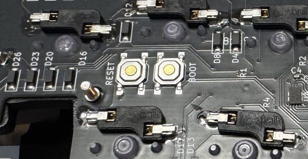

# ファームウェアの書き込み

ファームウェアは **QMK**（VIA 対応）です。コントローラが RP2040 なので、書き込みは UF2 ファイルのドラッグ&ドロップだけで完了します。

!!! info "左右の両方に書き込みます"

    分割キーボードのため、**左手側・右手側の両方**に同じファームウェアを書き込んでください。

## 1. ビルド済みファームウェアの入手

最新のファームウェアは [Releases](https://github.com/kazubu/axtp-guide/releases) から入手できます。

| ファイル | 用途 |
| --- | --- |
| `ai03_altair_x_via.uf2` | VIA 対応キーマップ |

## 2. ブートローダーへの入り方

RP2040 がブートローダーに入ると、PC に **`RPI-RP2`** という名前のドライブとしてマウントされます。

=== "キーボードから"

    VIA でキーマップに `QK_BOOT` を割り当てておくと、そのキーでブートローダーに入れます。

=== "BOOTSEL ボタン"

    USB ケーブルを抜いた状態で、基板裏面の BOOTSEL ボタンを押しながら PC に接続します。

    { loading=lazy }

=== "リセットボタン"

    基板裏面のリセットボタンを素早く 2 回押します。

    { loading=lazy }

## 3. 書き込み

1. ブートローダーに入り、マウントされた `RPI-RP2` ドライブを開く
2. `.uf2` ファイルをドライブにコピーする
3. 自動で再起動し、書き込み完了

## 4. ソースからビルドする

```bash
# QMK 環境の準備（初回のみ）
python3 -m pip install --user qmk
qmk setup

# この Mod のファームウェアを取得
git clone https://github.com/kazubu/holykeebs-qmk.git
cd holykeebs-qmk

# ビルド（成功するとリポジトリ直下に ai03_altair_x_via.uf2 が生成される）
make ai03/altair_x:via -e USER_NAME=holykeebs -e POINTING_DEVICE=trackpoint -e POINTING_DEVICE_POSITION=right -e OLED=no -e CONSOLE=no -j8
```

Auto Mouse Layer（ポインタ操作後、一定時間マウス用レイヤーを自動で有効にする機能）の設定は [キーマップの変更](../manual/keymap.md) を参照してください。

## 5. 書き込み後の確認

- [ ] キーが正しく入力される
- [ ] トラックポイントでカーソルが動く
- [ ] Auto Mouse Layer が動作する（ポインタ操作後にレイヤーが切り替わる）
- [ ] レイヤーが切り替わる

!!! tip "設定の初期化"

    挙動がおかしいときは EEPROM をクリアすると直る場合があります。キーマップに `CUSTOM(1)`（EEPROM 設定初期化）または `QK_CLEAR_EEPROM` を割り当ててクリアしてみてください。

---

キーマップの変更方法は [キーマップの変更](../manual/keymap.md) を参照してください。
