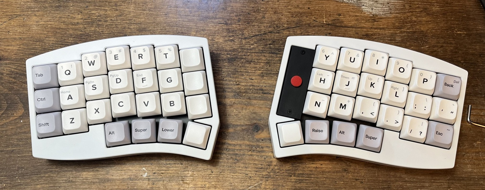

# Altair-X TrackPoint Mod

[ai03 Altair-X](https://github.com/ai03-2725) をベースに、ホームポジションのままポインタ操作ができるよう **Sprintek SK8707-01-004 ポインティングスティック** を専用のマウント基板経由で右手側の最内列に組み込んだ Mod です。このサイトではその **ビルドガイド** と **利用マニュアル** を公開しています。

{ loading=lazy }

## この Mod でできること

- 右手側キーボード最内列部のトラックポイントによるポインタ操作
- ポインタ操作後一定時間の間アクティブなレイヤーを変更する Auto Mouse Layer
- レイヤーキーを押している間のスクロール操作
- 感度・スクロール量などのランタイム設定（再フラッシュ不要）

## 主な仕様

| 項目 | 内容 |
| --- | --- |
| ベース | ai03 Altair-X |
| レイアウト | 分割カラムスタッガード |
| コントローラ | RP2040 |
| ポインティングデバイス | Sprintek SK8707-01-004（内部 PS/2 接続） |
| ファームウェア | QMK + VIA |
| 接続 | USB-C 有線 |

## ドキュメントの構成

- :material-tools: **[ビルドガイド](build/01-bom.md)**

    部品の準備から実装、トラックポイントの組み込み、ファームウェア書き込みまでの手順。

- :material-book-open-variant: **[利用マニュアル](manual/usage.md)**

    レイヤーの使い方、Auto Mouse Layer、キーマップのカスタマイズ、レイヤー状態の通知アプリ。

- :material-help-circle: **[トラブルシュート](troubleshooting.md)**

    動かない・挙動が変なときの切り分け手順。

- :material-comment-question: **[FAQ](faq.md)**

    よく聞かれること。

## 作業前に必ずお読みください

!!! warning "自己責任でお願いします"

    この Mod は非公式な改造です。作業によってキーボードやトラックポイントモジュールが破損する可能性があります。オリジナルの Altair-X の設計者・販売元、および本ドキュメントの作者は、改造の結果に対して一切の責任を負いません。

!!! danger "静電気とはんだ作業への注意"

    - 基板やトラックポイントモジュールを扱う前に、必ず身体の静電気を放電してください。
    - はんだごては高温になります。換気を行い、やけどに注意してください。

## 難易度と所要時間

| 項目 | 目安 |
| --- | --- |
| 難易度 | ★★★★☆（細かいはんだ付けが必要） |
| 所要時間 | 約 1.5 - 2 時間 |
| 必須スキル | はんだ付け（SK8707-01-004 の細ピッチ端子を含む）、精密ネジの取り扱い |

## ライセンス / 謝辞

- オリジナルの Altair-X は [ai03](https://ai03.com/) による設計です。

